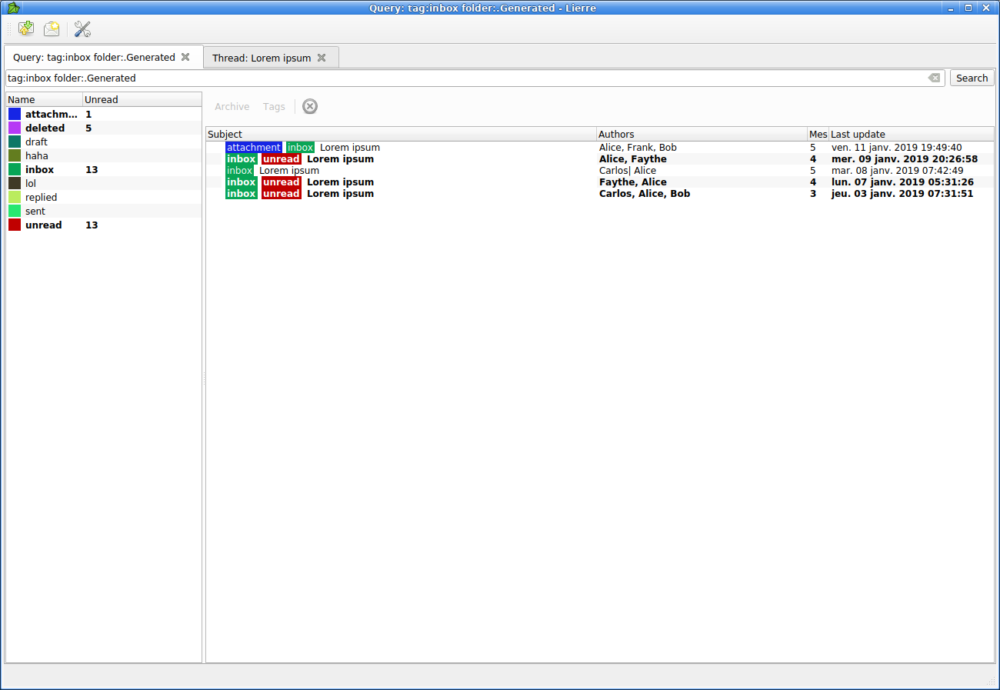
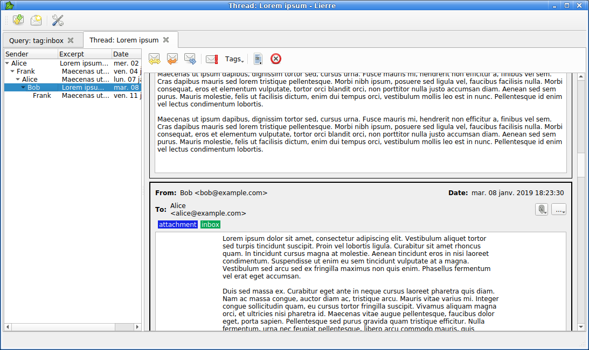

# Lierre

Lierre is a graphical email client using tags and fast search.

For tags and search, Lierre relies on [notmuch](https://notmuchmail.org/).
What's notmuch?

> Notmuch is not much of an email program. It doesn't receive messages (no POP or IMAP support). It doesn't send messages (no mail composer, no network code at all). And for what it does do (email search) that work is provided by an external library, Xapian. So if Notmuch provides no user interface and Xapian does all the heavy lifting, then what's left here? Not much.

Lierre uses the same approach. For example, Lierre itself does not implement IMAP or SMTP by itself.

* mail indexing/tagging/searching is done with notmuch
* mail fetching is done with a choice of apps, like [mbsync](http://isync.sourceforge.net/) for IMAP
* mail sending is done with a choice of other apps, like [msmtp](https://marlam.de/msmtp/)
* passwords handling cryptography can be done with [pass](https://www.passwordstore.org/)

Lierre is a Graphical User Interface, it interfaces with the aforementioned apps, sometimes using plugins, and allows easy viewing of emails.
For example, one can fetch new emails directly within the Lierre app without running mbsync manually.

Lierre is still under heavy development. See TODO.md for future features.
Lierre is licensed under the WTFPL version 2.

